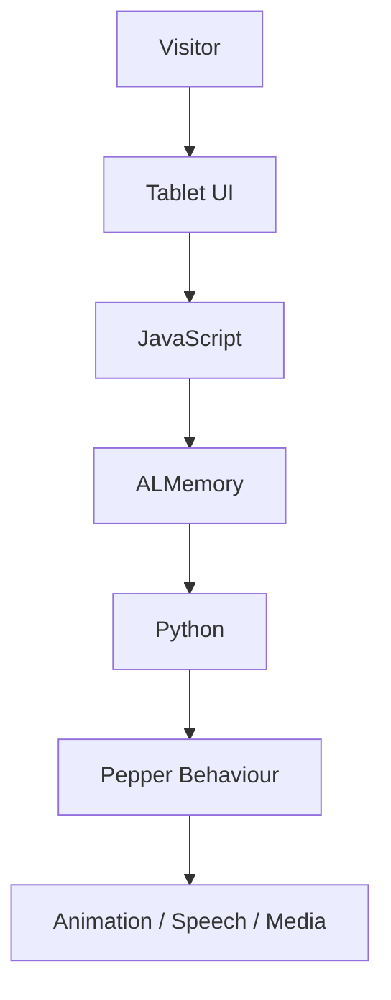

# Pepper Freshers Project Overview

## Introduction
The Pepper Freshers project was developed to provide a single interactive application for Pepper to use during the University of Hull Freshers' Fair.

The original idea was to avoid having multiple separate Choregraphe projects. Instead, everything would be managed from one master project, making it easier to maintain and extend.

## Main Objectives

- Create one master application.
- Use the tablet as the primary user interface.
- Allow demonstrations to be added without rebuilding the project.
- Support local testing without Pepper.
- Produce a professional demonstration for the Freshers' Fair.

## High-Level Flow

