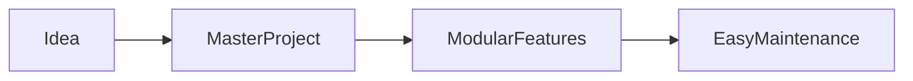

# Project Goals

## Why this project?

The goal was to build a maintainable demonstration system rather than a collection of separate demos.

## Design Decisions

- One master Choregraphe project.
- Tablet-first interface.
- Modular structure.
- Easy to maintain.
- Easy for future committee members to expand.

