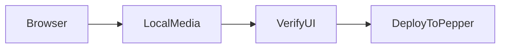

# Local Testing

Local testing allows development without access to Pepper.

## Advantages

- Faster development
- Easier debugging
- Test HTML and JavaScript locally

```mermaid
flowchart LR
Browser-->LocalMedia-->VerifyUI-->DeployToPepper
```
